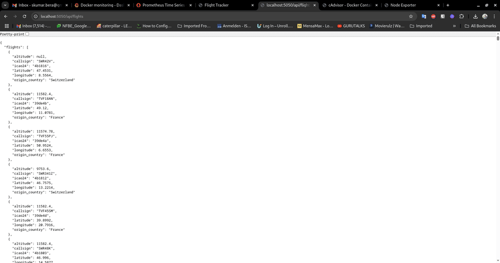

# 🛫 Flight Tracker - DevOps Demo

A real-time flight tracking web application with a full CI/CD DevOps pipeline and full-stack observability.

## 🚀 Features

- Real-time flight data via OpenSky API
- Flask backend API
- Plain JavaScript frontend with Leaflet.js map
- Auto-refreshing flight data every 30 seconds
- Animated aircraft markers on a Europe-centered map
- CI/CD-ready with GitHub Actions integration (planned)
- Dockerized deployment across frontend, backend, and monitoring
- Live on AWS EC2 with Docker Compose
- Monitoring with Prometheus, Grafana, node-exporter, and cAdvisor

## 📦 Project Structure

```
flight-tracker-devops/
├── backend
│   ├── app.py
│   ├── Dockerfile
│   └── requirements.txt
├── cleanup.sh
├── frontend
│   ├── app.js
│   ├── Dockerfile
│   ├── index.html
│   └── nginx.conf
├── infra
│   ├── docker-compose.yml
│   ├── prometheus_config/
│   │   └── prometheus.yml
│   └── grafana/
│       └── provisioning/
│           └── datasources/
│               └── prometheus.yaml
└── README.md
```

## 🌍 Latest Enhancements (Apr 2025)

- Europe-focused Leaflet.js map view
- Aircraft markers animate in place with real-time refresh
- Flight popups include callsign, origin, and altitude
- Backend filters flights within European airspace only
- Nginx reverse proxy handles clean API routing from frontend
- Docker Compose maps frontend to `3000`, backend to `5050`
- Added Prometheus and Grafana containers for monitoring
- Integrated node-exporter and cAdvisor for system & container metrics
- Grafana auto-provisions Prometheus as a data source

## 📡 Deployment Targets

- EC2 (Docker Compose)
- PostgreSQL via AWS RDS (Free Tier - optional)
- Public API integration with OpenSky Network

## 🔧 To Run Locally

```bash
./cleanup.sh
docker-compose up --build
```

Then visit:
- Frontend: http://localhost:3000
- API: http://localhost:5050/api/flights
- Prometheus: http://localhost:9090
- Grafana: http://localhost:3001 (admin / admin)



## 📚 Coming Next

- GitHub Actions CI/CD pipeline to auto-deploy to EC2
- Store flight snapshots in AWS RDS PostgreSQL
- Display flags + direction for flights on map
- Trigger webhook alerts if no flights appear for 2 refresh cycles